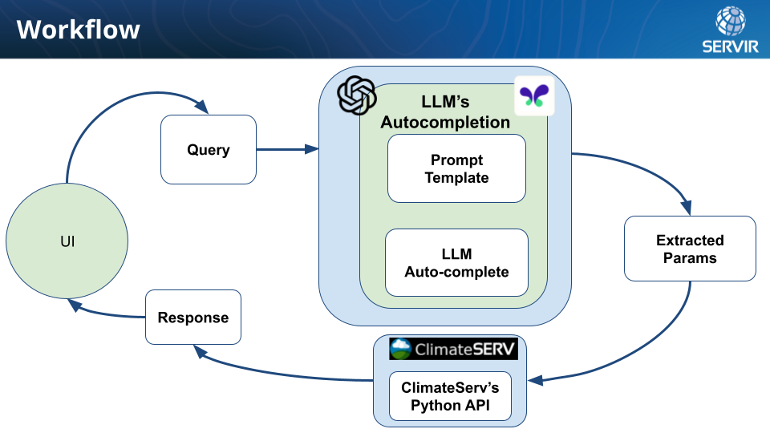

# Talking with the Climate - ClimateServ API GPT Tool

Welcome to the repository! This project was originally the output of my participation at the [3rd SMD and ETD Workshop on A.I. and Data Science: Leaping Toward Our Future Goals](https://emg-wd.wixsite.com/ai-ml-meeting-2023) organized at the NASA Goddard Space Flight Center. The script was originally developed for the OpenAI's ChatGPT. Then the Makersuite and Palm API was integrated as a part of the result of a Makersuite sprint for the Google Developer Expert (GDE).

Having worked multiple years on developing and translating scientific product into user facing tools (some tools I worked on are [here](https://servir.adpc.net/tools)), it takes a lot of time and effort in developing these UI tools. You are limited by how complex of the UI tools you can develop. The idea behind developing this tool is to provide a bridge between the powerful capabilities of Large Language Models (LLM) and the ClimateServ API (or basically any API), so data scientist and developers can focus their energy in developing complex API that user can use with a free-flow text. The tool is a proof of concept at this point and is in a very preliminary stage, but if you have time, resources and common interest, please reach out to me and we can work on this.


## Features

- **Language model based query generation**: Construct intricate queries for the ClimateServ API with the help of the LLM.
- **Chart Visualization**: Visual representations make data comprehension more intuitive.

## Getting Started

### Prerequisites

- Python 3.10
- Conda environment (Recommended)

### Setup

1. **Clone the Repository**:

   ```bash
   git clone https://github.com/biplovbhandari/makersuite-sprint.git
   cd makersuite-sprint
   ```

2. **Setup Conda Environment**:

    Create a new Conda environment using Python 3.10:
    ```bash
    conda create -n climateserv-gpt-tool python=3.10
    ```
    Activate the conda environment:
    ```bash
    conda activate climateserv-gpt-tool
    ```

3. **Install Dependencies:**:

    With the Conda environment activated, install the necessary packages using the `requirements.txt`.
    ```bash
    pip install -r requirements.txt
    ```

## Usage
You can start the `gradio` app using
```python
python ui-chat-gpt.py
```
for running using OpenAI's ChatGPT.

```python
python ui-maker-suite.py
```
for running using Makersuite and Palm API.

## Contributing

We welcome contributions to this repository! I am currently looking for LLM developer who will be willing to collaborate and help make this tool more mature. If you have ideas on improving this tool, please reach out to me directly.

## Contact

For any questions or concerns related to this project, please reach out to bionicbiplov45@gmail.com or create an issue in this repository.

## License

This tool is available under the open source [Apache License 2.0](https://github.com/biplovbhandari/climateserv-gpt/blob/main/LICENSE).


## Workflow


